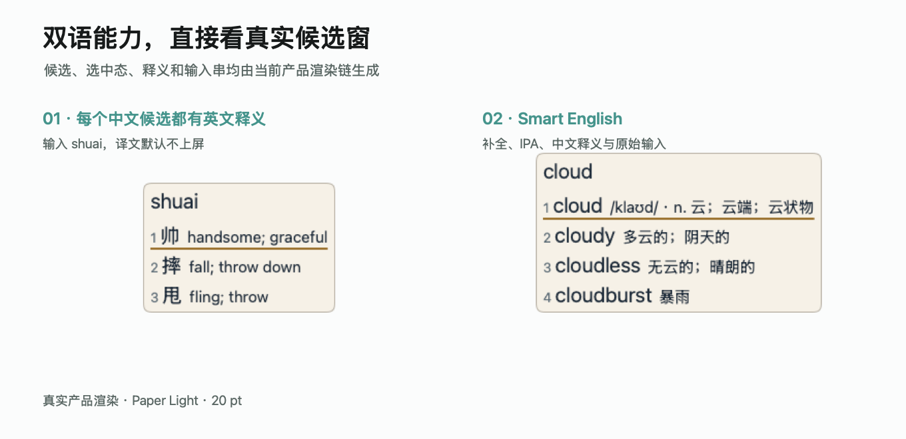
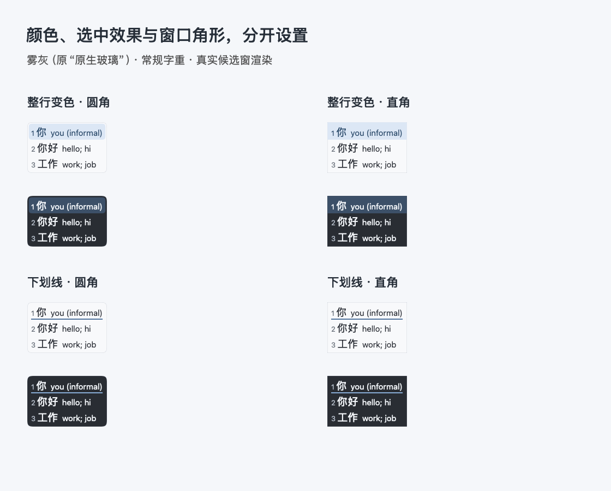

# ZIME

ZIME 是一款面向 Apple Silicon、macOS 13 及以上版本的本地优先双语输入法。
它把候选原文和翻译分开显示：候选主文本是实际输入内容，灰色副文本是本地
释义；只有用户主动切换到译文候选并确认时，译文才会上屏。

当前版本：[0.1.20 开发预览](https://github.com/zgat/ZIME/releases/tag/v0.1.20)。
提供完整 ZIP、PKG 和 Core-only ZIP。本次修复拼音纠错、混合输入和候选学习；
已有 0.1.17 完整词库的用户可只更新 Core，首次安装请选择完整包。
仍为未公证的 Ad-hoc 预览；GitHub 自动生成的 Source code 归档不是输入法安装器。

## 功能

- 两个 macOS 输入源：“ZIME 简体中文”和“ZIME 繁體中文”，共用设置和学习数据；
- 中文全拼、多字词、首字母缩写、保守模糊音与错序纠正；
- 中文模式优先可靠中文词与已学词，简拼 `key` 默认优先“可以”；仅在中文
  匹配较弱时让常见英文优先，Shift 切换后的英文模式保持英文排序；
- 智能英文补全、拼写纠错、多词候选、常用缩写、IPA 和下一词预测；
- 字母后接没有对应候选序号的数字时，作为完整原文留在候选框，例如 `x7`；
- 每行候选都显示译文，默认竖排，候选数量下拉框可选 3–9；
- 候选固定按页显示，不再提供多页展开模式；Local Data 折叠项的整个标题行都可点击；
- 英文候选显示中文释义，中文候选显示英文释义，内置 CC-CEDICT 中英词典；
- 中文本地释义按地区筛选：简体为通用 + 大陆，繁体为通用 + 港澳台及新马；
- 本地同义译文去重，区分译义、注释和引用；在线译文显示来源，选中后完整上屏；
- 简繁词条分别匹配：“你／妳”不混用，“发”的發／髮不同词义均保留；
- 本地用户词频、自动组词、上下文排序、Emoji 与本地词库缓存；
- 轻按 Shift 切换中文/智能英文，Caps Lock 保持原始 ASCII；
- 候选翻页用 `-` 上一页、`=` / `+` 下一页，到首尾页停留，不把符号上屏；
- 默认仅保留 macOS 输入源菜单，不再另建中英文状态栏图标；
- 原生设置界面，以及给高级用户的 Rime YAML 投影。
- 八套浅色/深色配色；主题只换颜色，选中效果和窗口角形独立设置；
- 候选词与设置预览使用相同常规字重，翻译不再触发加粗。



默认按 Tab 切换原文／译文，数字键选择当前页对应候选，Enter 提交原始输入，
Option-Tab 智能补全。输入 `key` 后回车得到 `key`，数字键才选择“可以”等
候选；在译文状态下回车也不提交译文。空格提交原文并附加空格，独立英文
可关闭附加空格；鼠标点击选词保留。三项快捷键均可在设置中直接录入。
没有进入译文候选状态时，翻译仅用于展示，不会自动附加到输入内容。


0.1.5 将原「原生玻璃」更名为「雾灰」，原「macOS」更名为「澄蓝」，优化中性
底色、细边框和选中配色。两者是 ZIME 自绘候选窗的配色，不是系统输入法的
原生候选组件。旧主题 ID 保留，不会重置已选主题。

「设置 → 外观 → 候选窗口」可分别选择「整行变色／下划线」和「圆角／直角」。
整行选中背景跟随窗口角形；下划线使用可见度更高的强调色。主题小样与实际
候选窗跟随这些选项，切换配色不会改字体、选中效果、角形或材质。外观模式
仍可选择系统、浅色或深色；无需重新编译词库。



所有候选均按自身字形查译文，不会因为当前使用简体或繁体模式就屏蔽另一种
字形。地区仅影响释义偏好：例如简体模式优先将“土豆”解释为 `potato`；
没有对应地区释义时仍使用词典已有译文，“德士”也能显示 `taxi`。

本地候选行和 Tab 切换后的译文上屏共用核心释义，例如“你／妳”均为 `you`、
“费城”为 `Philadelphia, Pennsylvania`；不同含义继续用 ` / ` 分隔。
建库完整保留原始词条，再使用与运行时相同的解析器生成译义：明确的用法注释
不参与上屏，异体字或缩写引用按目标字形和读音查找，并防止循环引用。
普通 `see you tomorrow` 不作为引用删除；括号按内容分类，保留语义限定、
完整语法释义、公式和未识别内容，例如 `capital (city)`。
在「设置 → 翻译」勾选「翻译显示完整注释」（默认关闭）后，悬停可查看原始
词义和注释；此开关不改变上屏文本。

## 离线与隐私

中英文词典、反向索引、纠错、预测和学习均在本机运行。完整交付包内含
CC-CEDICT 124,988 条源词条、四类带清单校验的离线数据包和万象 LTS 模型。

0.1.1 新增独立“翻译”设置页，可接入 OpenAI 兼容接口、DeepL、百度、腾讯。
云翻译默认关闭；只有开启并保存后，才发送当前页缺少本地译文的候选词，
不发送剪贴板、文档上下文或输入历史。API 可能收费，密钥仅保存在本机钥匙串。
“测试连接”按钮会明确发送固定单词 `hello`，不会自动开启云翻译。
候选框标明在线来源：`腾讯:you`、`百度:you`、`DeepL:you`，大模型兼容接口为
`ai:you`。本地已有可用译义（包括引用解析结果）时不再请求在线服务。
在线译文字段不套用本地词典的清理规则，括号、斜杠和换行均保留；Tab 切换后
数字选中会完整上屏，来源标签不上屏。超出 4,096 UTF-8 字节或含无效控制符的
结果整体拒收，不静默截断。

## 安装与构建

下载选择、首次安装、保留词频的升级流程与限制见
[ZIME 安装说明](docs/ZIME-INSTALL.md)；本次修复见
[0.1.20 版本说明](docs/releases/ZIME-0.1.20.md) 与 [更新日志](CHANGELOG.md)。
实现边界和行为合同见 [ZIME 设计说明](docs/ZIME.md)。

准备锁定的依赖和数据后，可执行：

```sh
no_download=1 ./action-build.sh release
./tests/verify_zime_translation.sh
./tests/verify_swift_units.sh
./tests/verify_rime_runtime.sh --zime-bilingual-probe
./tests/verify_rime_runtime.sh --zime-alphanumeric-probe
./tests/verify_english_data_projection.sh
```

从本地 Release 构建生成独立的 Ad-hoc 预览和离线安装包（目标路径必须不存在）：

```sh
scripts/stage-zime-preview /absolute/local/ZIME.app /absolute/preview/ZIME.app
scripts/build-zime-delivery /absolute/preview/ZIME.app /absolute/output/directory
```

开发预览包采用可验证的 Ad-hoc App 签名，PKG 未使用 Apple Developer ID 签名，
也未经过公证；它不能被描述为正式公证发行版。

0.1.1 的验证范围、词库比较和已知限制见
[验证记录](docs/ZIME-0.1.1-VALIDATION.md)。
0.1.2 的翻页边界与菜单栏修复见 [验证记录](docs/ZIME-0.1.2-VALIDATION.md)。
0.1.3 的地区释义与 macOS 配色见 [验证记录](docs/ZIME-0.1.3-VALIDATION.md)。
0.1.4 的词条归属、译义去重与注释分层见 [验证记录](docs/ZIME-0.1.4-VALIDATION.md)。
0.1.5 的配色、字重与独立外观选项见 [验证记录](docs/ZIME-0.1.5-VALIDATION.md)。
0.1.6 的中文简拼优先与跨语言学习排序见 [验证记录](docs/ZIME-0.1.6-VALIDATION.md)。
0.1.7 的候选展开代码清理与设置点击修复见 [验证记录](docs/ZIME-0.1.7-VALIDATION.md)。
0.1.8 修复中文模式下英文选词不学习的问题；中英文可随实际选词次数双向调整，记录跨重启保留。见 [验证记录](docs/ZIME-0.1.8-VALIDATION.md)。
0.1.9 将两种输入模式的学习隔离：中文模式内中英文一起排序，独立英文模式另行训练，互不影响。见 [验证记录](docs/ZIME-0.1.9-VALIDATION.md)。

0.1.10 将候选快捷键改为按键录入：Tab 切换原文／译文，Enter 确认当前候选，Option-Tab 智能补全待输入内容。三项独立配置并检查冲突，移除旧的仅译文上屏和 Tab 行为下拉设置。见 [验证记录](docs/ZIME-0.1.10-VALIDATION.md)。

0.1.11 为整个英文释义词表自动生成大小写查询索引，覆盖普通词、缩写和 `GraphQL / AppImage / DoH` 等混合大小写词头；例如 `ime / Ime / IME / iMe` 均显示“输入法编辑器”。原样输入候选和中文词库中的英文缩写也能显示释义，不改变候选原有大小写或上屏内容。见 [验证记录](docs/ZIME-0.1.11-VALIDATION.md)。

0.1.12 修复字母后数字提前上屏导致顺序颠倒：每页 5 个候选时输入 `x7`，首位且唯一候选就是完整的 `x7`，回车一起上屏；继续输入数字或字母仍保留为同一原文。当前页有效的数字选词保持不变。Core-only 更新也适用于已安装的旧词库。见 [验证记录](docs/ZIME-0.1.12-VALIDATION.md)。

0.1.13 将候选按键选词改为数字，回车改成“输入原文”，空格也不再选择高亮候选。原文／译文状态使用同一规则；保留已手动选定的前缀，其余部分按原文提交，不把未选候选计入学习。见 [验证记录](docs/ZIME-0.1.13-VALIDATION.md)。

0.1.14–0.1.16 补齐候选分页与原生译文提交、Emoji 学习、翻译设置统一应用/撤销，
并加入在线来源标签、完整 API 译文上屏和无损本地词库解析。
见 [0.1.16 版本说明](docs/releases/ZIME-0.1.16.md) 与
[翻译解析验证](docs/ZIME-TRANSLATION-SOURCES-2026-09-08.md)。

0.1.18–0.1.20 修复 `i` 被英文缩写补全抢占、`woi` 过度组句，以及 `nui` 缺少中文
换位纠错的问题；新增 `wov → 我v` 这类保留尾串的完整混输候选。别名和补全按实际
输入、当前模式学习，不污染原生中文前缀；已有词库可通过 Core 更新获得修复。
见 [0.1.20 版本说明](docs/releases/ZIME-0.1.20.md)。

## 上游与许可证

ZIME 基于 [Linnet](https://github.com/Ares-X/Linnet) 的
`9334c4ac563b0dad341c3661c59a4e4467b01e36` 修改，并间接使用 Squirrel、
librime、万象、RIME-LMDG、rime-ice 和 HallelujahIM。修改后的组合源码按
[GPL-3.0-or-later](LICENSE.txt) 发布；数据与第三方代码的精确来源和许可证见
[THIRD_PARTY_NOTICES.md](THIRD_PARTY_NOTICES.md) 与 `LICENSES/`。
