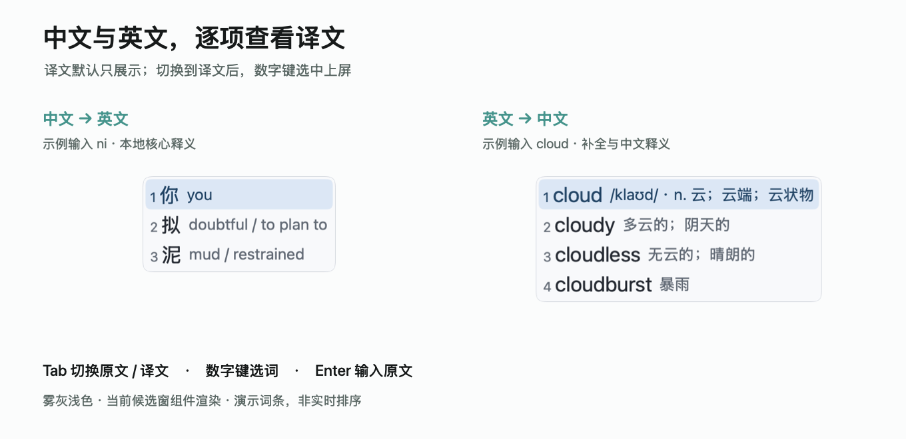
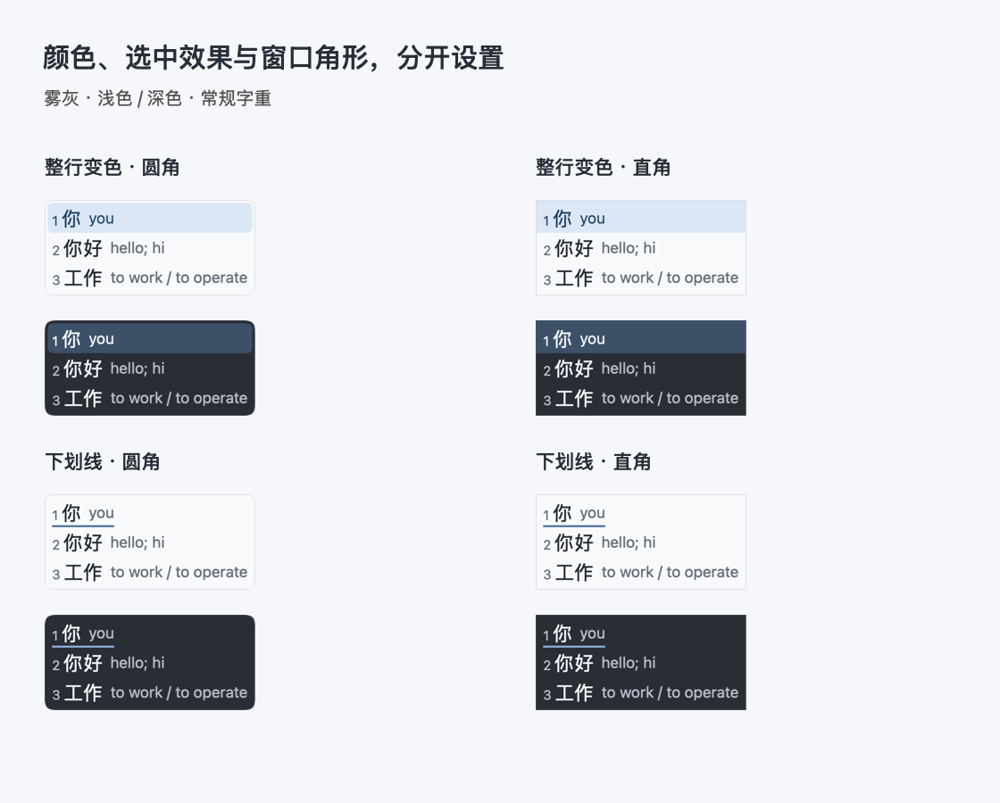

# ZIME

面向 Apple Silicon、macOS 13 及以上版本的本地优先双语输入法。
输入中文看英文释义，输入英文看中文释义；译文默认只在候选框展示，主动切换并选中后才会上屏。

[下载 0.1.22 开发预览](https://github.com/zgat/ZIME/releases/tag/v0.1.22) ·
[安装说明](docs/ZIME-INSTALL.md) · [更新日志](CHANGELOG.md)



## 输入与选词

- 中文全拼、多字词、首字母缩写、模糊匹配与拼写纠错，例如 `key → 可以`、`nui → 牛`。
- 中英文混输，未匹配的字母可保留在完整候选中，例如 `wov → 我v`；字母数字组合如 `x7` 也保持完整。
- 智能英文支持补全、纠错、缩写、IPA 和下一词预测；英文释义支持大小写查询，例如 `ime / IME / iMe`。
- 中文模式内中文、英文和 Emoji 共同学习排序；独立英文模式单独学习，记录在本机保存。
- 简体与繁体两个 macOS 输入源共用设置和学习数据。候选默认竖排，固定按页显示，每页可选 3–9 项。

| 默认按键 | 行为 |
| --- | --- |
| `Tab` | 切换候选原文／译文 |
| 数字键 | 选择当前页对应候选 |
| `Enter` | 提交原始输入，不选择高亮候选 |
| 空格 | 上屏当前高亮候选，原文／译文均支持 |
| `Option-Tab` | 智能补全 |
| 轻按 `Shift` | 切换中文／智能英文 |
| `Caps Lock` | 切换原始 ASCII 输入 |
| `-` / `=` / `+` | 上一页／下一页，到首尾页停留 |

原文提交、原文／译文切换和智能补全的快捷键可在设置中直接录入；也支持鼠标点击选词。
例如输入 `key` 后按 Enter 得到 `key`，按空格选择高亮的“可以”等候选；在译文状态下 Enter 也只提交原始输入。
中文候选与译文不额外附加空格；独立英文原文候选可在设置中选择是否附加空格。没有正在输入的内容时，空格仍正常输入空格。

## 翻译

每个候选独立查询译文，中文显示英文释义，英文显示中文释义；没有可用结果时显示“无译文”。
简繁字形分别匹配，地区只影响释义偏好，不会屏蔽另一种字形的译文。

- 本地译文保留核心词义，多义用 ` / ` 分隔。例如“你／妳”为 `you`，“费城”为 `Philadelphia, Pennsylvania`。
- 原始词条完整保留，译义、注释和引用分层处理；有意义的括号内容仍保留。
- 在“设置 → 翻译”勾选“翻译显示完整注释”后，悬停可看完整注释；此开关不改变上屏内容。
- 支持 OpenAI 兼容接口、DeepL、百度和腾讯。在线译文显示 `ai:`、`DeepL:`、`百度:` 或 `腾讯:` 来源，选中时只提交完整译文，不带来源标签。


## 外观

提供雾灰、澄蓝、宣纸青黛等八套配色，每套均有浅色与深色版本，可跟随系统外观。
主题只改变颜色，字号、选中效果和窗口角形独立设置。

在“设置 → 外观 → 候选窗口”选择“整行变色／下划线”和“圆角／直角”。
整行选中背景跟随窗口角形，候选文字使用常规字重；设置预览与候选窗保持一致。



配图使用当前候选窗组件和内置配色渲染，词条为演示样例，不代表实时输入的完整候选顺序。

## 离线与隐私

完整安装包包含中英文词库、CC-CEDICT 本地翻译词典和万象 LTS 模型。
词典查询、纠错、预测和学习在本机运行，无需联网。

云翻译默认关闭。开启并保存后，只发送当前页缺少本地译文的候选词，不发送剪贴板、文档上下文或输入历史。
本地已有可用译义时不请求在线服务；API 可能收费，密钥保存在 macOS 钥匙串。
“测试连接”会发送固定单词 `hello`，不会自动开启云翻译。

## 安装与升级

- **完整 ZIP / PKG**：包含程序、离线词库和模型，适合首次安装或更新全部内置数据。
- **Core ZIP**：更新程序及随附资源，保留已安装的语言词库和模型；需要已有兼容的完整数据。
- 两种升级方式均保留个人词频、自定义词和设置，并创建回滚备份，不必先卸载。

已有 0.1.17 完整数据可直接更新 Core。下载入口和操作步骤见 [安装说明](docs/ZIME-INSTALL.md)。
仍为 Ad-hoc 开发预览：PKG 未使用 Developer ID 签名，App 和 PKG 均未经过 Apple 公证，未开启自动更新频道。
GitHub 自动生成的 Source code ZIP/TAR 是源码，不是安装包。

## 更新公告

- **0.1.22**：精简设置与退役功能，加固翻译设置失败恢复，完善测试、缓存和发布校验；词库与输入规则不变。[详情](docs/releases/ZIME-0.1.22.md)
- **0.1.21**：空格上屏高亮候选，支持原文与译文；Enter 仍提交原始输入。[详情](docs/releases/ZIME-0.1.21.md)
- **0.1.20**：修复拼音纠错与候选学习，支持 `wov → 我v` 等完整混输候选。[详情](docs/releases/ZIME-0.1.20.md)
- **0.1.17**：更新万象词库和 LTS 模型，提供完整 ZIP、PKG 与 Core 更新包。[详情](docs/releases/ZIME-0.1.17.md)

更早的变更与验证范围见 [验证记录索引](docs/VALIDATION.md)，完整更新说明见 [更新日志](CHANGELOG.md)。

## 开发与构建

准备锁定的依赖和数据后，可执行：

```sh
no_download=1 ./action-build.sh release
./tests/verify_development.sh core
```

生成 Ad-hoc 预览和离线安装包（预览 App 目标路径必须不存在）：

```sh
scripts/stage-zime-preview /absolute/local/ZIME.app /absolute/preview/ZIME.app
scripts/build-zime-delivery /absolute/preview/ZIME.app /absolute/output/directory
```

实现边界见 [设计说明](docs/ZIME.md)，配图生成与核验方式见 [验证记录索引](docs/VALIDATION.md#readme-配图)。

## 上游与许可证

ZIME 基于 [Linnet](https://github.com/Ares-X/Linnet) 的
`9334c4ac563b0dad341c3661c59a4e4467b01e36` 修改，并间接使用 Squirrel、
librime、万象、RIME-LMDG、rime-ice 和 HallelujahIM。修改后的组合源码按
[GPL-3.0-or-later](LICENSE.txt) 发布；数据与第三方代码的精确来源和许可证见
[THIRD_PARTY_NOTICES.md](THIRD_PARTY_NOTICES.md) 与 `LICENSES/`。
